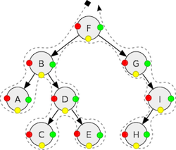
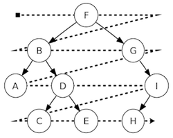

## 깊이 우선 탐색(DFS) vs 너비 우선 탐색(BFS)

> 너비 우선 탐색(Breadth First Search)와 깊이 우선 탐색(Depth First Search)는 비선형 자료구조인  
> 트리(Tree)와 그래프(Graph)의 순회(sequentially iterating over an entire set of data) 및      
> 탐색(using an index to jump directly to the result of interest)에 사용되는 알고리즘임

<br/>


<br/>

> 예를 들어 전화번호부에서 원하는 사람의 전화번호를 찾을 때 순회(traversal)는   
> 각 페이지와 항목을 `순차적으로 이동(sequential access)` 하는 것을 말하며,   
> 탐색(search)는 순차적으로 색인된 A-Z 탭을 사용해 `임의의 위치로 이동(random access)`하여     
> 순회 범위를 좁혀나가는 것을 의미함  

<br/>

#### 깊이 우선 탐색(Depth First Search)

* ###### 시간복잡도

* ###### 순회 및 탐색 방법



* pre-order (red): F, B, A, D, C, E, G, I, H;  
* in-order (yellow): A, B, C, D, E, F, G, H, I;  
* post-order (green): A, C, E, D, B, H, I, G, F.  

* ###### 장점

    * 단지 현 경로상의 노드들만을 기억하면 되므로 BFS에 대비하여 저장공간의 수요가 적음

    * 목표노드가 깊은 단계에 있을 경우 해를 빨리 구할 수 있음

* ###### 단점

    * 해가 없는 경로에 깊이 빠질 가능성이 있음

    * 얻어진 해가 최단 경로가 된다는 보장이 없음

<br/>

#### 너비 우선 탐색(Breadth First Search) 

* ###### 시간복잡도

* ###### 순회 및 탐색 방법



* Level-order: F, B, G, A, D, I, C, E, H.  

```c++

void bfs(struct Graph* graph, int startVertex) {

    struct queue* q = createQueue();
    
    graph->visited[startVertex] = 1;
    enqueue(q, startVertex);
    
    while(!isEmpty(q)){
        printQueue(q);
        int currentVertex = dequeue(q);
        printf("Visited %d\n", currentVertex);
    
       struct node* temp = graph->adjLists[currentVertex];
    
       while(temp) {
            int adjVertex = temp->vertex;

            if(graph->visited[adjVertex] == 0){
                graph->visited[adjVertex] = 1;
                enqueue(q, adjVertex);
            }
            temp = temp->next;
       }
    }
}


```

* ###### 장점

    * 출발 노드에서 목표 노드까지 최단 길이 경로를 보장함

* ###### 단점

    * 경로가 매우 길 경우, 탐색 가지의 급격한 증가로 인해 많은 메모리를 필요로 하게 됨