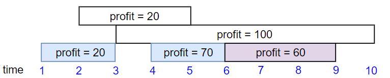

## Maximum Profit in Job Scheduling

We have n jobs, where every job is scheduled to be done from startTime[i] to endTime[i], obtaining a profit of profit[i].

You're given the startTime , endTime and profit arrays, you need to output the maximum profit you can take such that there are no 2 jobs in the subset with overlapping time range.

If you choose a job that ends at time X you will be able to start another job that starts at time X.

__Example 1:__


```ts
Input: startTime = [1,2,3,3], endTime = [3,4,5,6], profit = [50,10,40,70]
Output: 120
Explanation: The subset chosen is the first and fourth job. 
Time range [1-3]+[3-6] , we get profit of 120 = 50 + 70.
```

__Example 2:__



```ts
Input: startTime = [1,2,3,4,6], endTime = [3,5,10,6,9], profit = [20,20,100,70,60]
Output: 150
Explanation: The subset chosen is the first, fourth and fifth job. 
Profit obtained 150 = 20 + 70 + 60.
```

__Example 3:__


```ts
Input: startTime = [1,1,1], endTime = [2,3,4], profit = [5,6,4]
Output: 6
```
 
__Constraints:__

1. `1 <= startTime.length == endTime.length == profit.length <= 5 * 10^4`
2. `1 <= startTime[i] < endTime[i] <= 10^9`
3. `1 <= profit[i] <= 10^4`
