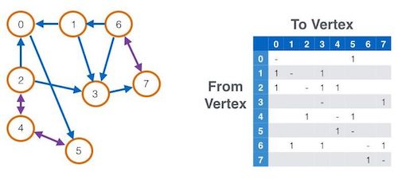
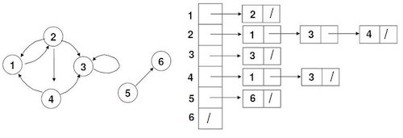

## 그래프

> 수학에서 그래프는 서로 연관이 있는 사물들을 짝 지워 연결한 구조를 의미함.  
> 여기서 사물은 Vertex(vertices, node, point)로 추상화되고 정점 간의 연결 및 Pairing은  
> Edge(link, line)로 추상화 됨  

> 컴퓨터 과학에서 그래프는 정점(Vertex)인 노드와 그 노드를 연결하는 간선(E, edge)을   
> 하나로 모아 놓은 자료 구조를 의미함  

#### 인접 행렬(Adjacent Matrix)

* ###### 공간복잡도

    * 간선이 많이 존재하는 밀집 그래프의 경우 인접 행렬 방식으로 구현하는 것이 유리함

    * 1차원 배열의 공간 복잡도는 O(V) 2차원 배열의 공간 복잡도는 O(V^2)

    * 행렬 구현에서 정점(V)의 개수와는 달리 간선(E) 수는 행렬의 크기와는 무관함(공간 복잡도는 O(V^2))

* ###### 시간복잡도

    * 두 정점을 연결하는 간선의 존재 여부는 시간복잡도 O(1) 안에 확인이 가능함

    * 정점 간 모든 간선의 탐색은 시간복잡도 O(V^2)이 소요됨

#### 인접 리스트(Adjacent List)

* ###### 공간복잡도

    * 정점(V)의 숫자에 비해 간선(E)의 밀집도가 적은 희소 그래프의 경우 인접 리스트 방식으로 구현하는 것이 유리함

    * 정점(V)마다 인접 리스트가 있으므로 O(V+E)의 공간 복잡도를 가짐

* ###### 시간복잡도

    * 두 정점을 연결하는 간선이 존재하는지 여부를 확인하는 데에는 해당 정점의 차수만큼의 시간이 소요됨

    * 정점 간 모든 간선의 탐색은 시간복잡도 O(V+E)이 소요됨

#### 트리와의 비교

|  | 그래프 | 트리 |
| :--- | :--- | :--- |
| 방향성 | - | o |
| 사이클 | 사이클 가능, 자체 간선도 가능 | 사이클 불가능, 자체 간선 불가능 |
| 루트 노드 | 루트 노드의 개념이 없음 | 한 개의 루트 노드만이 존재  |
| 부모 자식  | 부모 자식 개념이 없음 | 한 개의 루트 노드만이 존재  |
| 형태  | 네트워크 | 계층  |
| 순회  | DFS, BFS | DFS, BFS |
| 예시  | 지도, 지하철 노선도, 도로 | 이진트리, 균형 트리, 이진 힙 |

#### 단점

* 기본적으로 연결리스트형 노드는 포인터를 따라 탐색이 이루어지기 때문에 spatial locality와 hardware prefetch의 이점이 사라짐

    * spatial locality는 기억 장치 내의 정보를 균일하게 접근하는 것이 아니라 특정 부분을 집중적으로 참조하는 것을 의미함

    * hardware prefetch는 프로그램 실행에 필요한 요소를 미리 파악하여 프로세서 캐시에 미리 로딩하는 메커니즘을 의미함

#### 관련 문제들

* __Easy__
    * [Find the Town Judge](https://leetcode.com/problems/find-the-town-judge/)
    * [Flower Planting With No Adjacent](https://leetcode.com/problems/flower-planting-with-no-adjacent/)

* __Medium__
    * [Partition Array for Maximum Sum](https://leetcode.com/problems/partition-array-for-maximum-sum/)
    * [Regions Cut By Slashes](https://leetcode.com/problems/regions-cut-by-slashes/)
    * [Is Graph Bipartite](https://leetcode.com/problems/is-graph-bipartite/)

* __Hard__
    * [Minimize Malware Spread II](https://leetcode.com/problems/minimize-malware-spread-ii/)

#### 참고

* [Königsberg: Seven Small Bridges, One Giant Graph Problem](https://medium.com/basecs/k%C3%B6nigsberg-seven-small-bridges-one-giant-graph-problem-2275d1670a12)

* [방향 비순환 그래프(DAG, Directed Acyclic Graph)](https://jackpot53.tistory.com/84) 

* [그래프(Graph)의 개념](https://gmlwjd9405.github.io/2018/08/13/data-structure-graph.html)

* [4. 자료구조 (Graph)](https://hibee.tistory.com/294)

* [Breadth first search](https://www.programiz.com/dsa/graph-bfs)

* [그래프 기본 용어](https://ratsgo.github.io/data%20structure&algorithm/2017/11/18/graph/)