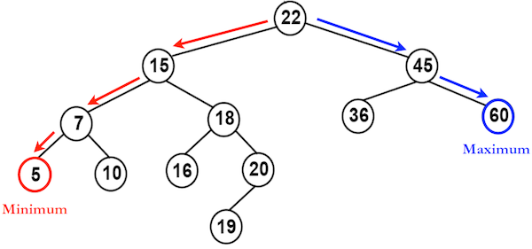
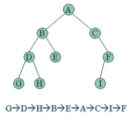
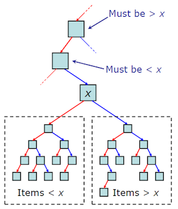
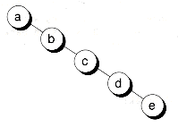

## 이진 탐색 트리

> 이진 탐색 트리(Binary Search Tree)는 이진 탐색(Binary Search)과 연결 리스트(Linked list)를 결합한 자료구조의   
> 일종으로 `정렬된 배열`이 가지는 이진 탐색의 효율적인 탐색 능력을 유지하면서, 입력과 삭제 시 개선된 성능을 보장함
> 
> 선형 자료 구조(Linear Data Structure)로서 논리적으로 한 가지의 순회만 가능한 `정렬된 배열`(연결 리스트)과는 달리,   
> 비선형 자료구조(Non-linear Data Structure)로서 깊이 우선 탐색(Depth First Traversal)에 해당하는  
> 전위(pre-order), `중위(in-order)`, 후위(post-order) 순회와 너비 우선 탐색(Breath First Traversal)에 해당하는  
> 레벨 순서(level-order) 탐색 탐색이 가능함
>
> 한편 이진 트리(binary tree)는 `각각의 노드가 최대 두 개의 자식 노드를 가지는 비선형 자료구조`를 말하며,   
> 이진 탐색 트리(BST)는 이진 트리의 하위 개념으로 `각각의 노드가 왼쪽 자식 노드` 보다는 크고 `오른쪽 자식 노드`   
> 보다는 작도록 `정렬된 이진 트리`를 지칭함

#### 순회 및 탐색 방법

* 중위(in-order) : 왼쪽 subtree 탐색 -> root 탐색 -> 오른쪽 노드

    1. 왼쪽 노드 방향을 우선적으로(그리고 재귀적으로) 이동(포인터 옮기기)하며 탐색(값 읽기)  
    2. 더 이상 왼쪽으로 이동할 수 없을 때 다시 경로를 거슬러 이동(포인터 옮기기)하며 탐색(값 읽기)  
    3. 최상위 노드로 다시 돌아간 이후에는 오른쪽 노드를 이동하며 왼쪽 노드 방향으로 이동할 수 있는지 확인
    4. 왼쪽 노드 방향으로 이동할 있으면 (i ~ iii)까지 반복하고, 그렇지 않으면 탐색(값 읽기)

#### 공간복잡도

* 먼저 각각의 노드마다 왼쪽 자식, 오른쪽 자식, 자신의 값을 저장할 세 개의 pointer가 필요함
* 그리고 N개의 노드가 연결 리스트 형태로 연쇄되어 저장되므로 O(N)의 공간복잡도가 요구됨

#### 시간복잡도

* 균형 이진 탐색과 마찬가지로 노드 이동 시마다 탐색 범위가 N -> N/2 -> N/4 -> ... -> 1으로 줄어듦

* 루트 노드(최상위 노드)를 중심으로 좌우가 고르게 분포되어 있다고 가정하면 평균적으로 O(log N)의 깊이와 성능을 나타냄
* 최악의 경우 (변질 트리)에는 노드 이동 시에 탐색 범위가 -1 만큼씩만 감소하므로 O(N)의 성능을 나타냄
* 입력과 삭제는 탐색 후 노드 추가가 이뤄지므로 탐색과 마찬가지로 O(log N)의 성능이 기대됨

#### 단점

* 이진 탐색 트리는 이진 탐색 원리에 기반한 자료구조임 
    * 트리의 균형이 편중될 경우 탐색 성능이 악화될 수 있음

#### 관련 문제들

* __전형적인 문제__
    * [Search in a Binary Search Tree](https://leetcode.com/problems/search-in-a-binary-search-tree/)

* __Easy__
    * [Two Sum IV - Input is a BST](https://leetcode.com/problems/two-sum-iv-input-is-a-bst/)
    * [Convert Sorted Array to Binary Search Tree](https://leetcode.com/problems/convert-sorted-array-to-binary-search-tree/)
    * [Minimum Distance Between BST Nodes](https://leetcode.com/problems/minimum-distance-between-bst-nodes/)

* __Medium__
    * [Unique Binary Search Trees](https://leetcode.com/problems/unique-binary-search-trees/)
    * [Delete Node in a BST](https://leetcode.com/problems/delete-node-in-a-bst/)

* __Hard__
    * [Maximum Sum BST in Binary Tree](https://leetcode.com/problems/maximum-sum-bst-in-binary-tree/)

#### 더 공부할 내용

* [이진 트리와의 비교](https://www.quora.com/Why-would-you-use-a-binary-tree-over-an-array-Is-it-mostly-language-dependent-In-what-cases-or-languages-would-you-always-use-a-tree-Lastly-is-it-all-about-memory-performance)

