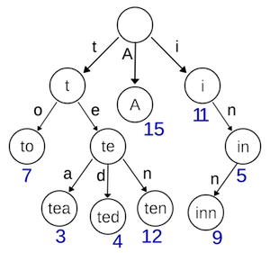
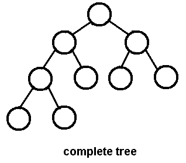
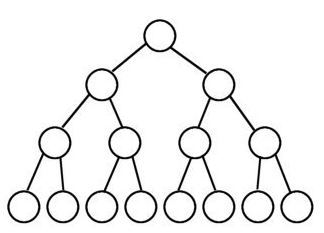
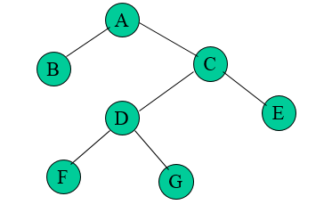
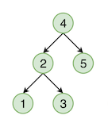
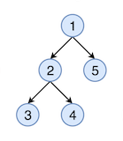
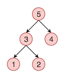
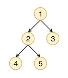

## 트리(Tree)

> 트리(tree)는 각각의 노드가 0개 이상의 자식을 가지는 구조가 반복되어 나타나는 비선형 자료구조를 말하며,  
> 그래프의 하위 개념임. 그래프가 최소 연결 그래프이면 트리에 해당하며, 트리는 방향이 있으면서 사이클은 없는  
> 그래프이기도 함
>     
> 알고리즘에서 트리는 주로 이진 트리(binary tree)를 다루는 경우가 대부분인데, 이는 n개의 자식을 가지는   
> 가변 트리는 이진 트리에 비해 구현이 복잡함에도 성능상 얻을 수 있는 이점이 거의 없기 때문임  
> 그 중에서도 이진 트리(binary tree)는 노드가 최대 2개의 자식을 가지는 구조가 반복되는 경우를 뜻함.
> 

#### 비이진트리(Binary Tree)

* ###### 전형

    * 트라이
    
        

#### 이진트리(Non Binary Tree)

* ###### 전형

    * 완전 이진트리(Complete Binary Tree)
    
         
    
        * 왼쪽 자식트부터 삽입되는 트리 형태로 왼쪽이 비어 있은채로 오른쪽이 채워지는 경우는 없음
        
        * Binary Heap은 완전 이진 트리임
    
    * 포화 이진트리(Perfect Binary Tree)
        
        
    
        * leaf가 아닌 노드는 항상 두 개의 자식 노드를 가짐
    
        * 포화 이진트리를 거꾸로 뒤집으면 가계도와 흡사한 형태가 됨
    
    * 정 이진트리(Full Binary Tree)
    
        
    
        * 모든 노드가 0개 혹은 2의 자식노드를 가짐
        
        * 정 이진 트리의 단말 노드의 수는 항상 내부 노드의 수보다 1보다 큼
    
    * 균형 이진 트리(Balanced Binary Tree)
    

* ###### 공간복잡도

    * 이진 트리의 메모리 사용량은 이진 검색 트리(Binary Search Tree)와 다르지 않으므로 해당 항목을 참조

* ###### 시간복잡도

    * 이진 트리 검색 성능 또한 노드가 배치 형태와 값의 분포에 따라 변동하는 방식이 이진 검색 트리와 크게 다르지 않음

* ###### 순회 및 탐색 방법

    * in-order(중위 순회) : 왼쪽 자식노드(L), 내 노드(P), 오른쪽 자식노드(R) 순서로 방문한다.

    

    * pre-order(전위 순회) : 내 노드(P), 왼쪽 자식노드(L), 오른쪽 자식노드(R) 순서로 방문한다.

    

    * post-order(후위 순회) : 왼쪽 자식노드(L), 오른쪽 자식노드(R), 내 노드(P) 순서로 방문한다.

    

    * level-order(레벨 순회) : 내 노드(P), 내 노드로부터 깊이 1인 노드들, 내 노드로부터 깊이 2인 노드들, ... , 내 노드로부터 깊이 N인 노드들 (N: 나(트리)의 깊이)

    

* ###### 순회의 구현

    ```c
    void inorder(struct node*root)
    {
        if(root)
        {
            inorder(root->left);         //Go to left subtree
            printf("%d ",root->data);    //Printf root->data
            inorder(root->right);        //Go to right subtree
        }
    }

    void preorder(struct node*root)
    {
        if(root)
        {
            printf("%d ",root->data);    //Printf root->data
            preorder(root->left);        //Go to left subtree
            preorder(root->right);       //Go to right subtree
        }
    }

    void postorder(struct node*root)
    {
        if(root)
        {
            postorder(root->left);       //Go to left sub tree
            postorder(root->right);      //Go to right sub tree
            printf("%d ",root->data);    //Printf root->data
        }
    }
    ```

* __Easy__
    * [Sum of Root To Leaf Binary Numbers](https://leetcode.com/problems/sum-of-root-to-leaf-binary-numbers/)
    * [Lowest Common Ancestor of a Binary Search Tree](https://leetcode.com/problems/lowest-common-ancestor-of-a-binary-search-tree/)
    * [Maximum Depth of Binary Tree](https://leetcode.com/problems/maximum-depth-of-binary-tree/)
    * [Longest Univalue Path](https://leetcode.com/problems/longest-univalue-path/)

* __Medium__
    * [Path In Zigzag Labelled Binary Tree](https://leetcode.com/problems/path-in-zigzag-labelled-binary-tree/)
    * [All Possible Full Binary Trees](https://leetcode.com/problems/all-possible-full-binary-trees/)
    * [Print Binary Tree](https://leetcode.com/problems/print-binary-tree/)
    * [Flatten Binary Tree to Linked List](https://leetcode.com/problems/flatten-binary-tree-to-linked-list/)
    * [Serialize and Deserialize BST](https://leetcode.com/problems/serialize-and-deserialize-bst/)

* __Hard__
    * [Binary Tree Cameras](https://leetcode.com/problems/binary-tree-cameras/)

#### 더 공부할 내용

* [Complexity of different operations in Binary tree, Binary Search Tree and AVL tree](https://www.geeksforgeeks.org/complexity-different-operations-binary-tree-binary-search-tree-avl-tree/)

* [Demystifying Depth-First Search](https://medium.com/basecs/demystifying-depth-first-search-a7c14cccf056)

* [자료구조 - 이진 트리(Binary Tree)란 (이진탐색트리와의 차이점) - 수정중](https://galid1.tistory.com/176)

* [트리(tree)와 이진트리(binary tree)](https://ratsgo.github.io/data%20structure&algorithm/2017/10/21/tree/)

* [Binary Search Tree](https://www.hackerearth.com/practice/data-structures/trees/binary-search-tree/tutorial/)

* [Breadth first search](https://www.programiz.com/dsa/graph-bfs)

* [방향 비순환 그래프(DAG, Directed Acyclic Graph)](https://jackpot53.tistory.com/84)

* [Tree](https://www.interviewcake.com/concept/java/tree)

* [트리(tree)와 이진트리(binary tree)](https://ratsgo.github.io/data%20structure&algorithm/2017/10/21/tree/)